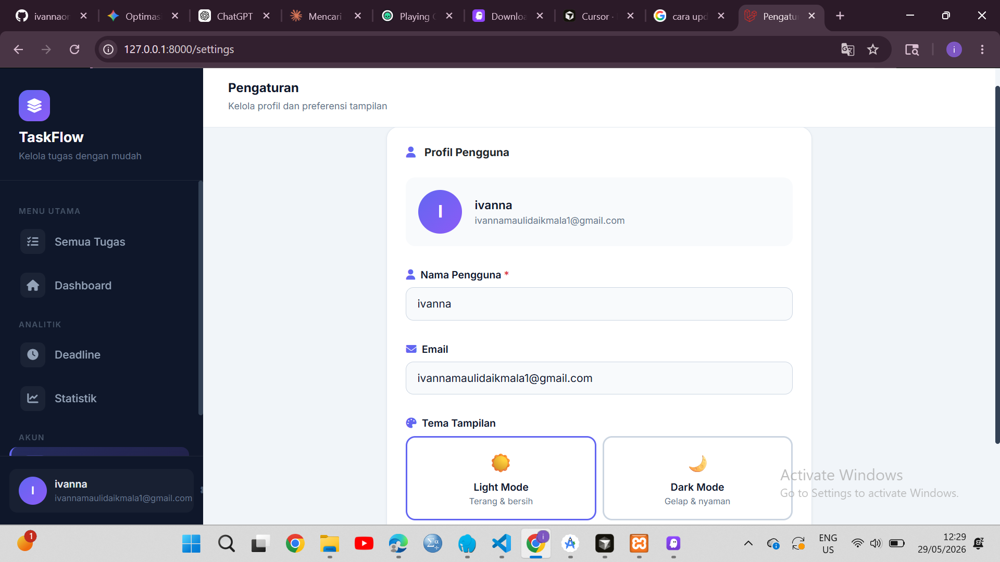

# TaskFlow — Modern To-Do List App

Aplikasi manajemen tugas berbasis web yang dibangun dengan **Laravel 11** dan **Bootstrap 5**. Dirancang dengan tampilan modern, mendukung dark/light mode, dan dilengkapi fitur analitik tugas.

---

## ✨ Fitur Utama

- **Manajemen Tugas** — Tambah, edit, hapus, dan tandai tugas selesai
- **Prioritas Tugas** — Tinggi 🔴, Sedang 🟡, Rendah 🟢
- **Filter & Pencarian** — Filter berdasarkan status dan prioritas secara real-time
- **Dashboard Analitik** — Donut chart progress, deadline hari ini, aktivitas terbaru
- **Statistik** — Bar chart distribusi status, tingkat penyelesaian per prioritas
- **Deadline Tracker** — Pantau tugas yang melewati batas waktu
- **Dark / Light Mode** — Tema tersimpan di session
- **Responsive** — Sidebar di desktop, bottom navigation di mobile

---

## 📸 Screenshots

### Semua Tugas
.png)

### Dashboard


### Statistik


### Deadline
.png)

### Pengaturan


---

## 🛠️ Tech Stack

| Layer | Teknologi |
|-------|-----------|
| Backend | Laravel 11 (PHP 8.2+) |
| Frontend | Bootstrap 5.3, Font Awesome 6.5 |
| Chart | Chart.js 4.4 |
| Database | SQLite / MySQL |
| Font | Inter (Google Fonts) |

---

## 🚀 Instalasi

### 1. Clone repository

```bash
git clone https://github.com/username/todo-list.git
cd todo-list
```

### 2. Install dependencies

```bash
composer install
```

### 3. Konfigurasi environment

```bash
cp .env.example .env
php artisan key:generate
```

### 4. Setup database

Edit `.env` sesuai konfigurasi database kamu, lalu jalankan:

```bash
php artisan migrate
```

### 5. Jalankan aplikasi

```bash
php artisan serve
```

Buka browser dan akses `http://localhost:8000`

---

## 📁 Struktur Halaman

| Route | Halaman | Deskripsi |
|-------|---------|-----------|
| `/tasks` | Semua Tugas | Daftar semua tugas dengan filter & search |
| `/dashboard` | Dashboard | Ringkasan statistik & aktivitas terbaru |
| `/statistics` | Statistik | Analitik visual penyelesaian tugas |
| `/deadline` | Deadline | Tugas yang melewati batas waktu |
| `/settings` | Pengaturan | Profil pengguna & tema tampilan |

---

## 📝 Lisensi

MIT License — bebas digunakan dan dimodifikasi.
