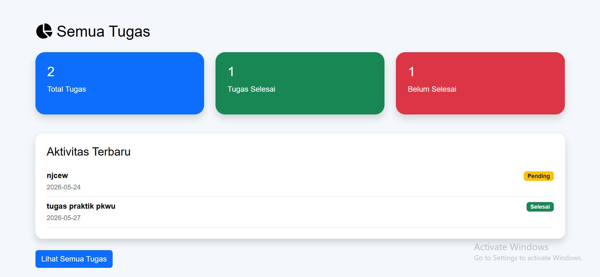
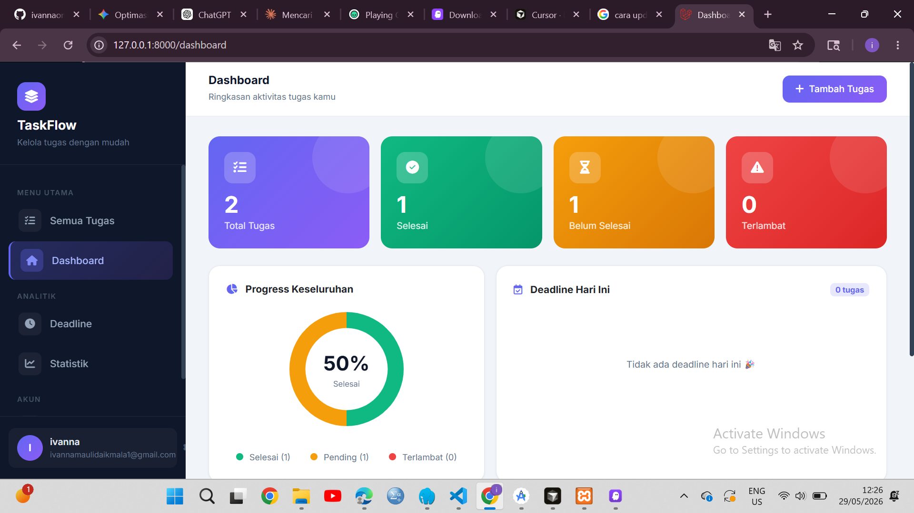
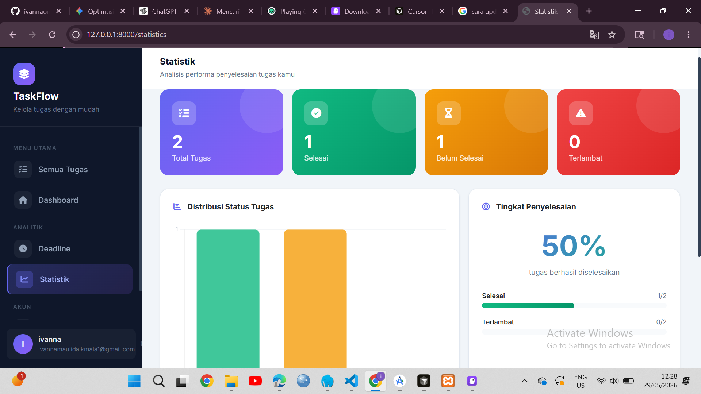
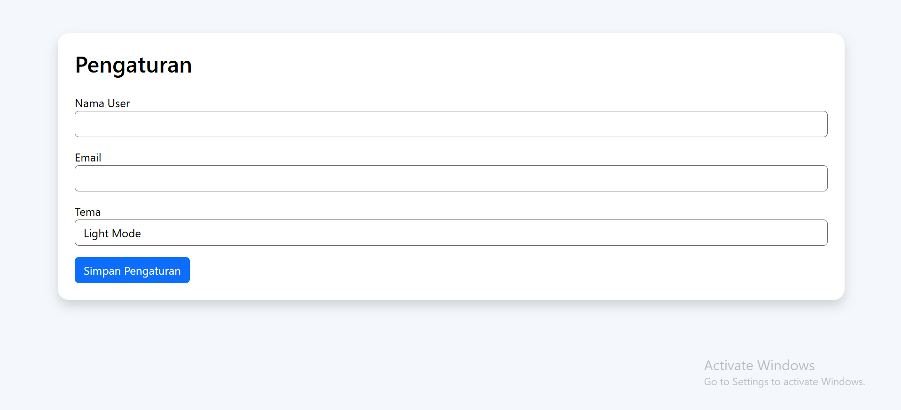

# TODO-LIST

Aplikasi manajemen tugas berbasis web yang dibangun dengan **Laravel**. Dilengkapi fitur deadline, statistik, dan pengaturan personal.

---

## Fitur

- **Manajemen Tugas** — Tambah, edit, hapus, dan tandai tugas sebagai selesai
- **Deadline** — Pantau tugas-tugas yang mendekati atau melewati batas waktu
- **Statistik** — Lihat ringkasan progress tugas secara visual
- **Pengaturan** — Kustomisasi preferensi aplikasi

---

## Tech Stack

- **Framework:** Laravel (PHP)
- **Frontend:** Blade Template Engine
- **Database:** MySQL / SQLite

---

## Instalasi

### 1. Clone Repository

```bash
git clone https://github.com/username/todo-list.git
cd todo-list
```

### 2. Install Dependencies

```bash
composer install
npm install && npm run build
```

### 3. Konfigurasi Environment

```bash
cp .env.example .env
php artisan key:generate
```

Edit file `.env` sesuai konfigurasi database kamu:

```env
DB_CONNECTION=mysql
DB_HOST=127.0.0.1
DB_PORT=3306
DB_DATABASE=todo_list
DB_USERNAME=root
DB_PASSWORD=
```

### 4. Migrasi Database

```bash
php artisan migrate
```

### 5. Jalankan Aplikasi

```bash
php artisan serve
```

Akses di browser: [http://localhost:8000](http://localhost:8000)

---

## Routes

| Method | URL | Deskripsi |
|--------|-----|-----------|
| GET | `/` | Redirect ke `/tasks` |
| GET | `/tasks` | Daftar semua tugas |
| GET | `/tasks/create` | Form tambah tugas |
| POST | `/tasks` | Simpan tugas baru |
| GET | `/tasks/{id}/edit` | Form edit tugas |
| PUT/PATCH | `/tasks/{id}` | Update tugas |
| DELETE | `/tasks/{id}` | Hapus tugas |
| GET | `/dashboard` | Dashboard utama |
| GET | `/deadline` | Tugas dengan deadline |
| GET | `/statistics` | Statistik tugas |
| GET | `/settings` | Halaman pengaturan |
| POST | `/settings/save` | Simpan pengaturan |

---

## Screenshots

### Semua Tugas


### Dashboard


### Statistik


### Settings
