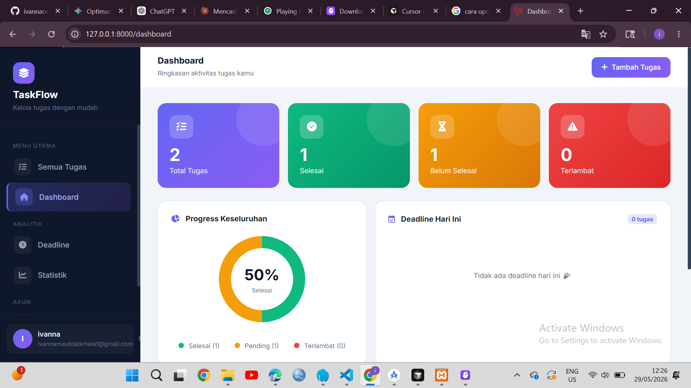
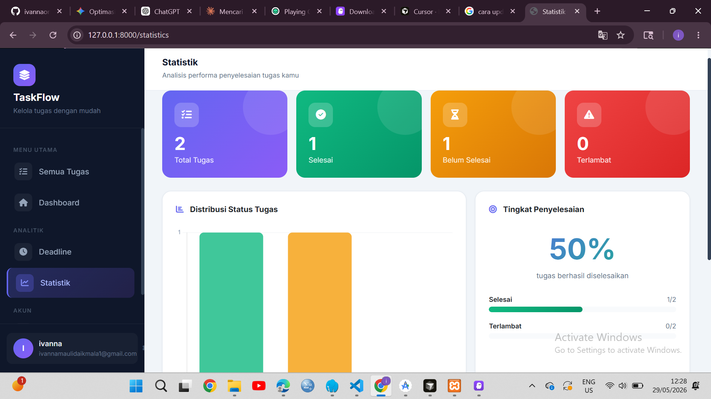
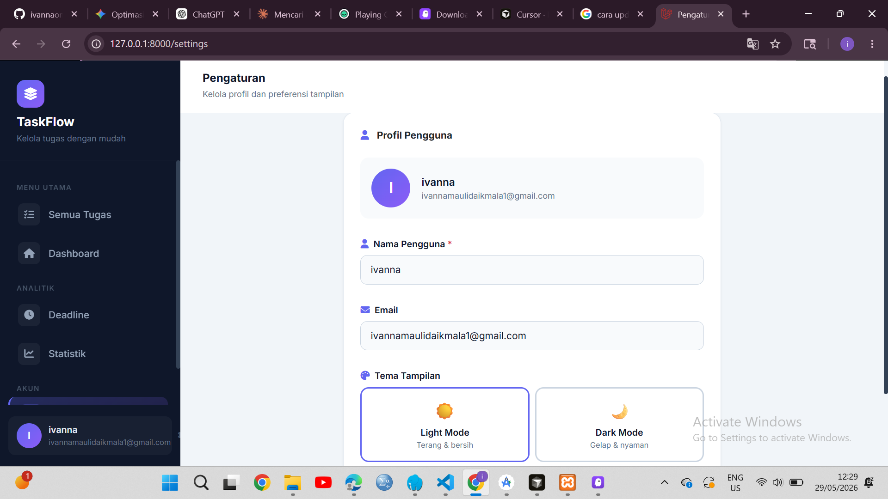

# TaskFlow — Modern To-Do List App

> Aplikasi manajemen tugas berbasis web yang dibangun dengan **Laravel 11** dan **Bootstrap 5**. Tampilan modern, mendukung dark/light mode, dan dilengkapi fitur analitik tugas.

---

## ✨ Fitur Utama

- **Manajemen Tugas** — Tambah, edit, hapus, dan tandai tugas selesai langsung dari daftar
- **Prioritas Tugas** — Tinggi 🔴, Sedang 🟡, Rendah 🟢 dengan indikator warna
- **Filter & Pencarian** — Filter berdasarkan status dan prioritas secara real-time tanpa reload
- **Dashboard Analitik** — Donut chart progress, deadline hari ini, dan aktivitas terbaru
- **Statistik Visual** — Bar chart distribusi status, tingkat penyelesaian per prioritas
- **Deadline Tracker** — Pantau tugas yang melewati batas waktu beserta hitungan hari keterlambatan
- **Dark / Light Mode** — Tema tersimpan di session, berlaku di seluruh halaman
- **Responsive Design** — Sidebar di desktop, bottom navigation di mobile
- **Konfirmasi Hapus** — Modal konfirmasi sebelum menghapus tugas
- **Validasi Form** — Validasi input dengan pesan error yang informatif

---

## 📸 Screenshots

### Semua Tugas
.png)

### Dashboard


### Statistik


### Deadline
.png)

### Pengaturan


---

## 🛠️ Tech Stack

| Layer | Teknologi |
|-------|-----------|
| Backend | Laravel 11 (PHP 8.2+) |
| Frontend | Bootstrap 5.3, Font Awesome 6.5 |
| Chart | Chart.js 4.4 |
| Database | SQLite / MySQL |
| Font | Inter (Google Fonts) |
| Icons | Font Awesome 6.5 |

---

## 📁 Struktur Proyek

```
todo-list/
├── app/
│   ├── Http/Controllers/
│   │   └── TaskController.php   # Controller utama semua fitur task
│   └── Models/
│       └── Task.php             # Model task dengan fillable fields
├── database/
│   └── migrations/              # Migration tabel tasks + priority
├── resources/views/
│   ├── layout/
│   │   └── app.blade.php        # Shared layout dengan sidebar & bottom nav
│   └── tasks/
│       ├── index.blade.php      # Halaman semua tugas
│       ├── create.blade.php     # Form tambah tugas
│       ├── edit.blade.php       # Form edit tugas
│       ├── dashboard.blade.php  # Dashboard & statistik ringkas
│       ├── statistics.blade.php # Statistik detail dengan chart
│       ├── deadline.blade.php   # Daftar tugas terlambat
│       └── settings.blade.php  # Pengaturan profil & tema
└── routes/
    └── web.php                  # Definisi semua route aplikasi
```

---

## 🚀 Instalasi

### Prasyarat

- PHP >= 8.2
- Composer
- SQLite atau MySQL

### Langkah Instalasi

**1. Clone repository**

```bash
git clone https://github.com/username/todo-list.git
cd todo-list
```

**2. Install dependencies PHP**

```bash
composer install
```

**3. Konfigurasi environment**

```bash
cp .env.example .env
php artisan key:generate
```

**4. Setup database**

Edit file `.env` sesuai konfigurasi database kamu:

```env
DB_CONNECTION=sqlite
# atau untuk MySQL:
# DB_CONNECTION=mysql
# DB_HOST=127.0.0.1
# DB_DATABASE=todo_list
# DB_USERNAME=root
# DB_PASSWORD=
```

**5. Jalankan migration**

```bash
php artisan migrate
```

**6. Jalankan server**

```bash
php artisan serve
```

Buka browser dan akses `http://localhost:8000`

---

## � Struktur Halaman & Route

| Method | Route | Halaman | Deskripsi |
|--------|-------|---------|-----------|
| GET | `/tasks` | Semua Tugas | Daftar semua tugas dengan filter & search |
| GET | `/tasks/create` | Tambah Tugas | Form tambah tugas baru |
| POST | `/tasks` | — | Simpan tugas baru |
| GET | `/tasks/{id}/edit` | Edit Tugas | Form edit tugas |
| PUT | `/tasks/{id}` | — | Update tugas |
| DELETE | `/tasks/{id}` | — | Hapus tugas |
| POST | `/tasks/{id}/toggle` | — | Toggle status selesai |
| GET | `/dashboard` | Dashboard | Ringkasan & aktivitas terbaru |
| GET | `/statistics` | Statistik | Analitik visual penyelesaian tugas |
| GET | `/deadline` | Deadline | Tugas yang melewati batas waktu |
| GET | `/settings` | Pengaturan | Profil pengguna & tema tampilan |
| POST | `/settings/save` | — | Simpan pengaturan |

---

## 🗄️ Struktur Database

### Tabel `tasks`

| Kolom | Tipe | Keterangan |
|-------|------|------------|
| id | bigint | Primary key |
| title | varchar | Judul tugas (wajib, min 3 karakter) |
| description | text | Deskripsi tugas (opsional) |
| deadline | date | Batas waktu (opsional) |
| is_done | boolean | Status selesai (default: false) |
| priority | enum | Prioritas: low / medium / high |
| created_at | timestamp | Waktu dibuat |
| updated_at | timestamp | Waktu diperbarui |

---

## 📝 Lisensi

MIT License — bebas digunakan dan dimodifikasi.
